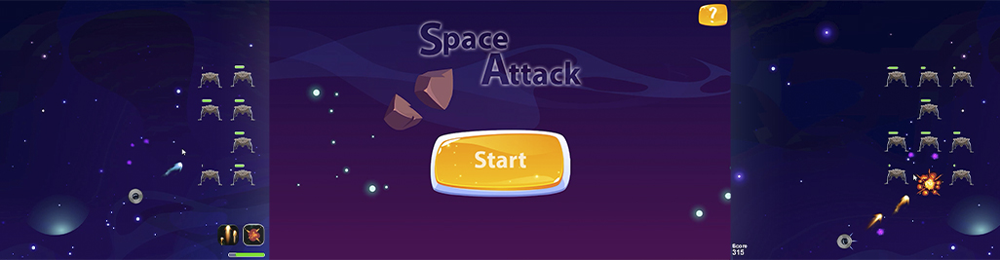

# SpaceAttack
Welcome to Space Attack, a reimagined version of the classic game Space Invaders. Crafted using the Processing 4.2 framework, this project presents a modern and exciting take on the beloved classic. Prepare to confront waves of alien enemies, striving to achieve the highest score and survive increasingly challenging waves. This endeavor is part of the Culminating Project for Creative Programming in the Multimedia degree program, showcasing the fusion of classic gameplay and cutting-edge development.

  

## Key Features

- Conquer waves of enemies and reach the highest score.
- Three types of enemy waves with escalating difficulty.
- Control your spaceship using mouse and keyboard for fluid and thrilling gameplay.
- Two attack modes to adapt to different situations.
- Customize your gameplay strategies and master space domination.

## Getting Started

1. **Clone the Repository:** Clone this repository to your local machine using the following command:
  git clone https://github.com/mirtor/SpaceAttack.git

2. **Requirements:** Make sure you have Processing 4.2 installed on your machine to run the project correctly.

3. **Run the Game:** Open the project in Processing and run the game. Ensure that all dependencies are loaded and up to date.

4. **Controls:** Use the "SPACE" key to toggle the pause menu. The "b / B" key switches between attack modes. Left-click to shoot and right-click to control your character's movement.

## Support

If you need help or have any questions, you can contact Víctor Díaz via [email](mailto:victor.diaz.iglesias@gmail.com) for assistance.

## Contribution

This project is maintained and improved thanks to contributions from the developer community. If you'd like to contribute, follow these steps:

1. Fork the repository.
2. Create a branch for your contribution: `git checkout -b new-feature`
3. Make your changes and commit them: `git commit -m "Add a new feature"`
4. Push the branch: `git push origin new-feature`
5. Open a Pull Request on GitHub.

## Credits

- Developer: Víctor Díaz Iglesias

## Resources and References

- Processing. (n.d.). Retrieved from https://processing.org/
  
- Upklyak. (n.d.). Juego de fuegos artificiales púrpuras que explotan: efecto de explosión de sprites de animación [Vector Image]. Retrieved from https://www.freepik.es/vector-gratis/juego-fuegos-artificiales-purpuras-que-explotan-efecto-explosion-sprites-animacion_21845823.htm#query=sprite%20sheet%20laser&position=39&from_view=search&track=ais
  
- Upklyak. (n.d.). Hoja de sprite de animación de secuencia de explosión de bomba [IVector Image]. Retrieved from https://www.freepik.es/vector-gratis/hoja-sprite-animacion-secuencia-explosion-bomba_29084609.htm#query=sprite%20sheet%20attack&position=1&from_view=search&track=ais

- Upklyak. (n.d.). Pistola que destella humo, destellos de fuego y nubes de disparos: pistola de explosión, escopeta boca, movimiento explosivo, senderos de balas y armas aisladas sobre fondo negro ilustración 3D realista conjunto de iconos [Vector Image]. Retrieved from https://www.freepik.es/vector-gratis/pistola-destella-humo-destellos-fuego-nubes-disparos-pistola-explosion-escopeta-boca-movimiento-explosivo-senderos-balas-armas-aisladas-sobre-fondo-negro-ilustracion-3d-realista-conjunto-iconos_10798305.htm#query=spritesheet%20bullet&position=28&from_view=search&track=ais

- Vectorpouch. (n.d.). Planetas en el espacio exterior con satélites y meteoritos [Vector Image]. Retrieved from https://www.freepik.es/vector-gratis/planetas-espacio-exterior-satelites-meteoritos-ilustracion_6690897.htm#query=space%20planet&position=1&from_view=search&track=ais

